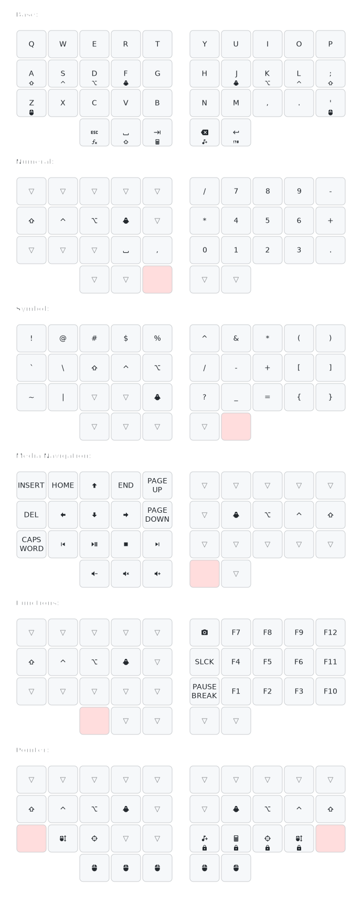
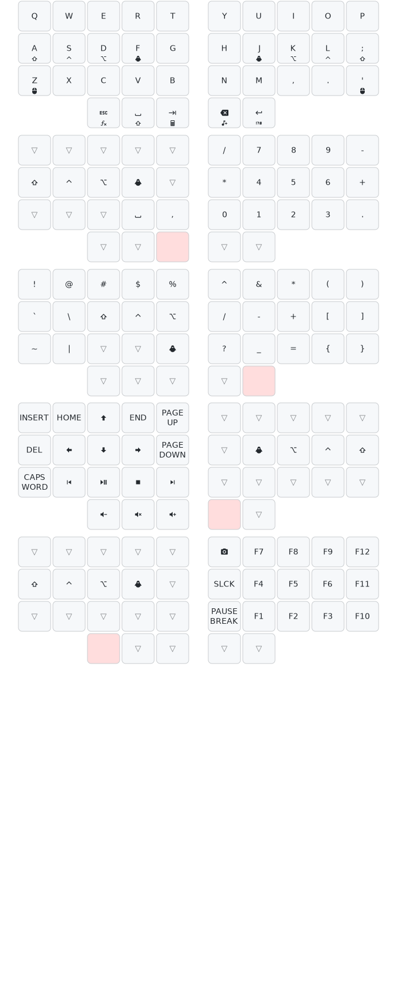

# ZMK Configuration

ZMK configuration for [charybdis nano](https://github.com/Bastardkb/Charybdis/tree/main) wireless
version with [nice!nano](https://nicekeyboards.com/nice-nano/).

Modify [charybdis.keymap](config/charybdis.keymap) to change the keymap. Docs [here](https://zmk.dev/docs).

To generate keymap files:

1. manually run `Build ZMK firmware` action from github. A zip with the following files will be generated:

- charybdis_left-nice_nano_v2-zmk.uf2
- charybdis_right-nice_nano_v2-zmk.uf2
- settings_reset-nice_nano_v2-zmk.uf2

2. Connect each half of the keyboard with an usb cable to the computer.
3. Double tap the reset button at the back.
4. The keyboard half should now be visible as a removable device.
5. Drag and drop the corresponding file to the removable device.
6. After copying the device will automatically unmout.
7. Reconnect the keyboards and enjoy.

To generated svg of the keymap, visit [Keymap drawer](https://keymap-drawer.streamlit.app) and copy [charybdis.yaml](keymap-drawer/charybdis.yaml) to **Keymap Specs** field and hit **Run** below

List of icons used are [here](https://icon-sets.iconify.design/mdi/)

#### Keymap with headers

#### Slim keymap for print

